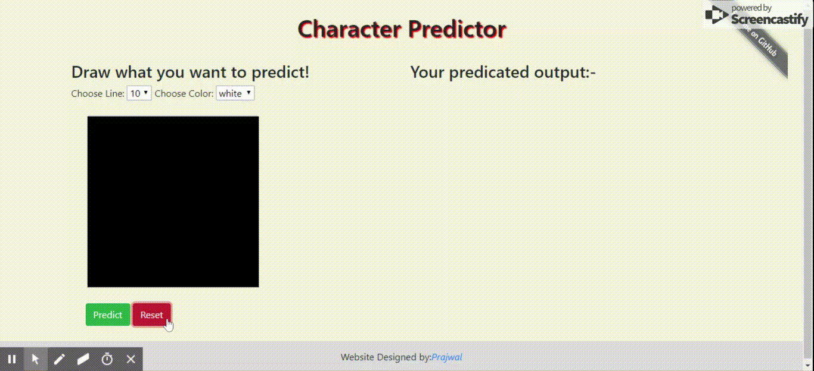

# Nepali Digit Recognizer
A flask app which can recognize nepali handwritten digit drawn in your canvas.
## Demo 


## Getting Started

### Prerequisites

You need to have python3.6 installed on your system to run this code locally. If you don't have python installed then, you can install from [here](https://www.python.org/downloads/). Tensorflow doesn't officially support python 3.7 on windows, so you need to install 3.6 version.


### Install and setup
1. Clone this repo.
``` 
git clone https://github.com/bhuwanaryal19/nepali_digit_recognizer
cd nepali_digit_recognizer
```

2. Make virtual env for python and install requirements.
```
python -m venv digit_env
source digit_env/bin/activate   # for linux
digit_env\Scripts\activate      # for windows
pip install -r requirements.txt
```

3. Run app.py and control click link to open app in  browser.

    ` python app.py`


## License

This project is licensed under the MIT License - see the [LICENSE](LICENSE) file for details

## Contribution Giudeline
If you like to contribute to this project, then here are some directions:
1. Approach this project as a active learning i.e get feedbacks for predictions and store predicted data along with labels and retrain with new data at certain interval. I believe this helps to improve the accuracy as in this case train, valid data are of different distributions than real data.
2. You can convert model into tflite model and make android app.
3. You can collect test data that will be representive of actual data and tune hyperparameters.
4. As our original data contains mislabels detedect those and label them correctly.

If you have any other suggestions or would like to collabrate in this project or any other, then connect me in [linkedin](https://www.linkedin.com/in/bhuwan-aryal888/).
## Credits

* [Prajwal Rai](http://prajjwalrai.com.np/) for frontend design.
* Dataset Used from [DHCD_Dataset](https://github.com/Prasanna1991/DHCD_Dataset).
* Inspired from [Siraj Raval](https://github.com/llSourcell/how_to_deploy_a_keras_model_to_production).

